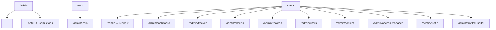
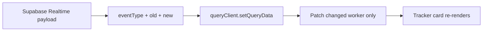
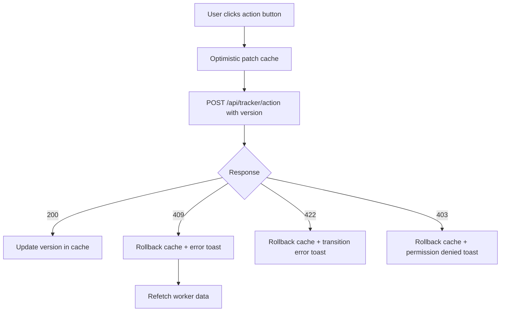
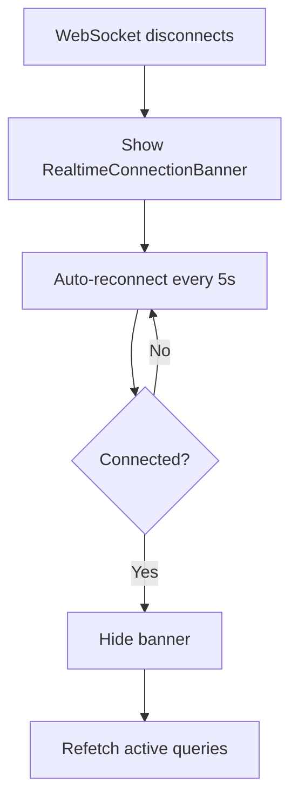
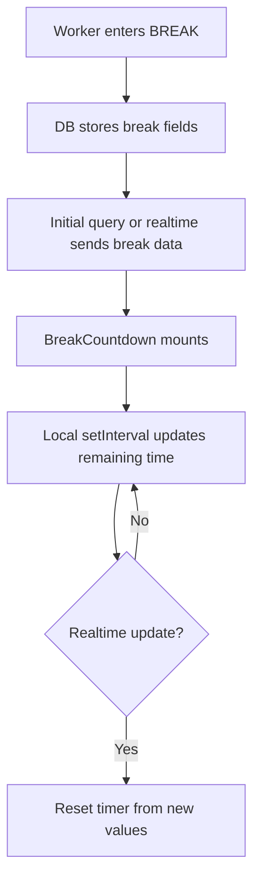

# Frontend Master Implementation Plan

## 1. Overview

Kireiku is a dual-surface product:

- a **public marketing surface** for buyers
- a **secured operational surface** for staff

The frontend rebuild starts from a **stable product foundation**:

- route structure
- layout shells
- design tokens and theme system
- permission-aware navigation
- realtime data strategy
- shared interaction patterns
- error handling conventions

This document is the single authoritative frontend plan. All page-level plans reference this as their baseline.

## 2. PRD Analysis

The PRD makes these frontend realities clear:

- The landing page is important, but the most complex frontend problem is the **admin panel**, especially the **tracker**.
- The tracker is the operational center of the product, so status colors, realtime behavior, component boundaries, and permission-aware actions must be locked early.
- The product has four tiers, but the UI splits into two main experiences:
  - public buyer UI
  - internal staff UI
- Permission rules affect more than middleware. They also affect:
  - sidebar visibility
  - page entry
  - action buttons
  - detail drawers
  - empty states
  - redirects
  - CMS field editability (footer fields are Owner-only)
- LATE and ALPHA are **derived states** — never stored in DB. The frontend must compute display status from `derived_status` in API responses or from raw fields (`status`, `alpha_done`, shift phase, time).

## 3. Locked Frontend Decisions

These are non-negotiable. They are the rebuild baseline.

### 3.1 Tech Stack

| Layer | Technology |
| --- | --- |
| Framework | Next.js App Router (stable current version) + TypeScript |
| UI Library | ShadCN UI + Tailwind CSS + CSS Variables |
| Server State | TanStack Query v5 (React Query) |
| UI State | Zustand |
| Forms | React Hook Form + Zod |
| Validation | Zod (client + server) |
| Database | Supabase PostgreSQL |
| Realtime | Supabase Realtime (WebSocket) |
| Auth | Supabase Auth (email/password + Google OAuth) |
| Cache | Upstash Redis (serverless) |
| Cron | Vercel Cron Jobs (every 1 minute, path: /api/auto-trigger) |
| Deployment | Vercel Pro |
| Animations | Framer Motion (landing page scroll effects only) |
| Icons | Lucide React |
| Charts | Recharts (dashboard only) |
| Virtualization | @tanstack/virtual (tracker with 100+ worker cards) |
| Testing | Vitest + Playwright |
| CI/CD | GitHub Actions + Vercel Preview Deployments |

### 3.2 Theme

- The app supports **`light`**, **`dark`**, and **`system`**.
- The product presentation is **dark-first**.
- The landing page should feel strongest in dark mode.
- The admin panel must remain fully usable in both light and dark modes.
- Theme tokens are defined via CSS custom properties using oklch color space (tweakcn template).
- ShadCN components consume tokens via Tailwind utility classes (`bg-background`, `text-foreground`, `border-border`, etc).

### 3.3 Typography

- Display headlines (landing page): **Orbitron Bold**
- Primary UI font: **Plus Jakarta Sans**
- Monospace font (times, IDs, code): **JetBrains Mono**

### 3.4 Form Stack

All significant forms in the admin panel should use:

- **react-hook-form**
- **zod** (with `zodResolver`)

This combination is the default for:

- login form
- user create/edit forms
- SP forms
- absensi edit forms
- records edit forms
- CMS forms (landing content, services, testimonials, FAQ)
- access manager actions with confirmations
- profile edit forms

### 3.5 Route Behavior

- `/admin/content` is an official route and must be part of the route map.
- `/admin` should **redirect to the first allowed admin page**.
- That redirect should happen in **`middleware.ts`**, not inside a page component, to avoid wrong-content flash.

### 3.6 Image And Asset Strategy

- Use **`next/image`** for all non-decorative images on the public surface.
- Service icons come from DB `icon_url` with a fallback to Lucide icons.
- Do not store large base64 image payloads in the database.
- Decorative background effects should be CSS/gradient driven where possible.
- Ambient effects on landing page use CSS gradients, noise textures, and geometric patterns — not heavy raster assets.

## 4. Canonical Status System

This must be defined on day one because it affects Tracker, Dashboard, Absensi, Records, badges, legends, filters, and SP-related emphasis.

```ts
// src/constants/status.ts
export const STATUS_CONFIG = {
  ON: {
    label: "ON",
    hex: "#22c55e",
    tone: "success",
  },
  BREAK: {
    label: "BREAK",
    hex: "#eab308",
    tone: "attention",
  },
  LATE: {
    label: "LATE",
    hex: "#ea580c",
    tone: "urgent",
    derived: true, // NOT stored in DB
  },
  ALPHA: {
    label: "ALPHA",
    hex: "#ef4444",
    tone: "danger",
    derived: true, // derived from alpha_done=true
  },
  OFF: {
    label: "OFF",
    hex: "#6b7280",
    tone: "neutral",
  },
  CUTI: {
    label: "CUTI",
    hex: "#3b82f6",
    tone: "info",
  },
  SAKIT: {
    label: "SAKIT",
    hex: "#f97316",
    tone: "info",
  },
  PENDING: {
    label: "PENDING",
    hex: "#a855f7",
    tone: "info",
  },
  LEMBUR: {
    label: "LEMBUR",
    hex: "#f59e0b",
    tone: "premium",
  },
} as const;
```

### Status Rules

- `BREAK` is yellow, not blue.
- `LATE` is deeper and more urgent than `BREAK`. It is a **derived state**: `status='off' AND alpha_done=false AND IN-SHIFT AND minutes_since_shift_start >= 10`.
- `ALPHA` is the strongest red danger state. It is a **derived state**: `alpha_done=true` (DB status remains `off`).
- `CUTI`, `SAKIT`, and `PENDING` must stay visually distinct from one another.
- `LEMBUR` should feel special, but not be confused with destructive actions.

### Display Status Resolution

API responses include a `derived_status` field. Frontend resolves display status:

```ts
function resolveDisplayStatus(worker: WorkerData): DisplayStatus {
  if (worker.derived_status) return worker.derived_status;
  return worker.status.toUpperCase();
}
```

### SP Level Visuals

```ts
// src/constants/status.ts (continued)
export const SP_CONFIG = {
  0: { border: "default", nameColor: "default", glow: false },
  1: { border: "#eab308", nameColor: "default", glow: false },
  2: { border: "#f97316", nameColor: "default", glow: false },
  3: { border: "#ef4444", nameColor: "#ef4444", glow: true,
       glowShadow: "0 0 16px rgba(239,68,68,0.3)",
       textShadow: "0 0 8px rgba(239,68,68,0.5)" },
} as const;
```

## 5. Product Information Architecture

```text
KIREIKU FRONTEND
├── Public Surface
│   └── /
│       ├── Hero
│       ├── Services
│       ├── Why Kireiku / Stats
│       ├── Testimonials
│       ├── How It Works
│       ├── FAQ
│       └── Footer
│
├── Auth Surface
│   └── /admin/login
│
└── Secured Admin Surface
    ├── /admin                     → redirect to first allowed page
    ├── /admin/dashboard
    ├── /admin/tracker
    ├── /admin/absensi
    ├── /admin/records
    ├── /admin/users
    ├── /admin/content
    ├── /admin/access-manager
    ├── /admin/profile
    └── /admin/profile/[userId]
```

### Admin Sidebar Navigation Order

```text
Dashboard        /admin/dashboard
Tracker          /admin/tracker
Absensi          /admin/absensi
Records          /admin/records
Users            /admin/users          (Owner + Admin)
Content          /admin/content        (Owner + Admin)
Access Manager   /admin/access-manager (Owner only)
─────────────────────────────────────
Profile          /admin/profile
Logout
```

Items are **hidden** (not disabled) if the user's tier lacks `view` permission per `access_permissions` DB table. Owner permissions are hardcoded and cannot be changed.

### Route Diagram



## 6. Folder Structure Baseline

```text
src/
├── app/
│   ├── (public)/
│   │   ├── layout.tsx
│   │   └── page.tsx
│   ├── admin/
│   │   ├── (auth)/
│   │   │   └── login/
│   │   │       └── page.tsx
│   │   └── (panel)/
│   │       ├── layout.tsx
│   │       ├── page.tsx
│   │       ├── dashboard/
│   │       ├── tracker/
│   │       ├── absensi/
│   │       ├── records/
│   │       ├── users/
│   │       ├── content/
│   │       ├── access-manager/
│   │       └── profile/
│   ├── api/
│   ├── globals.css
│   ├── layout.tsx
│   └── providers.tsx
├── components/
│   ├── ui/
│   ├── public/
│   ├── admin/
│   └── shared/
├── hooks/
├── lib/
│   ├── supabase/
│   ├── redis/
│   ├── auth/
│   ├── query/
│   ├── state-machine/
│   ├── realtime/
│   └── utils/
├── stores/
├── types/
├── constants/
└── styles/
```

This is summarized here and expanded in the dedicated folder-structure document.

## 7. Layout And Navigation Strategy

### 7.1 Public Navigation

- Brand logo
- `Services`
- `Why Kireiku`
- `Testimonials`
- `FAQ`
- theme toggle
- primary CTA `Order Now`

Rules:

- `Staff Login` appears only in the footer — extremely subtle, small, low opacity
- no `/admin` links in main nav
- anchored section scrolling on landing
- sticky blurred navbar after scroll
- Framer Motion for scroll-triggered animations and staggered reveals

### 7.2 Admin Navigation

- Persistent sidebar on desktop (240px expanded, 60px collapsed)
- Drawer/sheet navigation on mobile
- Items filtered by permission — **hidden**, not disabled
- `Access Manager` only visible to Owner
- `Profile` always visible to authenticated staff
- Live clock WIB (UTC+7) in header, format: `Fri 24 Apr 20.00`

### 7.3 `/admin` Redirect Rule

This must be handled in **middleware**.

Redirect order:

1. `/admin/dashboard`
2. `/admin/tracker`
3. `/admin/profile`

The first route the user is allowed to view becomes the destination.

### 7.4 Mobile Responsiveness

| Breakpoint | Behavior |
| --- | --- |
| < 640px (mobile) | Sidebar becomes hamburger drawer/sheet; tracker grid 1 column; tables with horizontal scroll |
| 640–1024px (tablet) | Sidebar collapsed (icon only); tracker grid 2 columns |
| > 1024px (desktop) | Sidebar full; tracker grid 3–4 columns |

## 8. Component Architecture

### 8.1 Shared Shell Components

```text
RootApp
├── Providers
├── PublicLayout
├── AdminAuthLayout
└── AdminPanelLayout
    ├── RealtimeConnectionBanner
    ├── AdminSidebar
    ├── AdminHeader
    ├── MobileNavDrawer
    └── PageContent
```

### 8.2 Public Surface Tree

```text
LandingPage
├── PublicNavbar
├── HeroSection
├── ServicesSection
├── WhyKireikuSection
├── TestimonialsSection
├── HowItWorksSection
├── FAQSection
└── PublicFooter
    └── StaffLoginLink
```

### 8.3 Tracker Component Tree

```text
TrackerPage
├── TrackerHeader
│   ├── LiveBadge
│   ├── LastSyncText
│   ├── AutoRefreshIndicator
│   └── ResetStatusButton (Owner only)
├── TrackerToolbar
│   ├── SearchInput
│   ├── ShiftFilter
│   ├── StatusFilter
│   ├── RoleFilter
│   └── SortSelect
├── TrackerGroupTabs
├── VirtualizedWorkerCardGrid
│   └── WorkerCard
│       ├── CardHeader
│       │   ├── WorkerIdentity
│       │   ├── ShiftChip / FlexibleBadge
│       │   ├── StatusBadge
│       │   └── SPIndicator
│       ├── CardMetrics
│       ├── BreakCountdown
│       └── ActionButtons
└── ResetStatusModal
```

### 8.4 Shared SP Visual System

```text
SPIndicator
├── Props: spCount (0 | 1 | 2 | 3)
├── Output: class modifier for border + glow
└── SPBadge
```

## 9. State Management Plan

### 9.1 React Query For Server State

Use TanStack Query for:

- worker list (tracker)
- dashboard summaries
- absensi grid data
- records tables
- users list
- profile data
- CMS content data
- permission matrix data
- SP data
- services and testimonials

### 9.2 Zustand For UI State

Use Zustand only for client UI state.

```ts
// stores/ui-store.ts
sidebarCollapsed: boolean
mobileNavOpen: boolean
themePanelOpen: boolean

// stores/tracker-ui-store.ts
activeFilters: TrackerFilters
activeGroup: string
sortMode: TrackerSortMode
selectedWorkerId: string | null
modalState: { type: string; data?: unknown } | null

// stores/auth-store.ts
session: Session | null
userTier: "owner" | "admin" | "member" | null
permissions: PagePermissions
```

### 9.3 Important Rule

Do not put server collections into Zustand if React Query already owns them. Zustand is for UI state, not for replacing query caching.

## 10. Realtime Strategy

### 10.1 Realtime Patch Flow

- Supabase Realtime sends row payloads: `eventType`, `new`, `old`
- The client listens to worker-related channels
- On payload receipt, update only the affected cached row via `queryClient.setQueryData`
- Do not refetch the full tracker list when a single worker changes

### 10.2 Realtime Patch Diagram



### 10.3 Optimistic Updates With Version Conflict Handling

Manual actions like `START`, `SELESAI`, `ISTIRAHAT`, `CUTI`, and `PENDING` should:

1. Patch local cache optimistically
2. Call API with current `version` field
3. On **200**: accept response, update version in cache
4. On **409 VERSION_CONFLICT**: rollback optimistic update, show error toast "Data telah berubah, memperbarui...", refetch latest worker data from server
5. On **422 INVALID_TRANSITION**: rollback, show error toast with transition error message
6. On **403 PERMISSION_DENIED**: rollback, show error toast "Akses tidak diizinkan"
7. Accept realtime confirmation when server update arrives

### 10.4 Version Conflict UI Flow



### 10.5 Realtime Disconnection Handling

When Supabase Realtime WebSocket disconnects:

1. Show persistent **RealtimeConnectionBanner** at top of admin layout: "Koneksi realtime terputus - data mungkin tidak terkini"
2. Banner includes a manual **Reconnect** button
3. Auto-reconnect attempt every **5 seconds**
4. When reconnected: hide banner, trigger full refetch of active queries to sync stale data
5. Banner must not block content — it sits above the page container, not overlay



## 11. Break Countdown Strategy

The countdown must be client-side and must not poll the server.

### Break Countdown Rules

- Source of truth: `break_started_at` + `break_accumulated_secs` + `break_timer_running`
- The tracker receives these fields on initial load and on realtime updates
- `BreakCountdown` uses local `useEffect` + `setInterval`
- Total elapsed = `break_accumulated_secs` + (if `break_timer_running`: `now - break_started_at`)
- Remaining = 3600 - total elapsed
- If a new realtime payload changes any break field, the timer resets from the new values
- No per-second server polling

### Break Countdown Flow



## 12. Forms Strategy

All admin forms should follow one pattern:

- `react-hook-form`
- `zodResolver`
- shared form field components
- server-side validation mirrored from the same Zod schema where possible

### Form Categories

- login
- user create/edit
- SP issue/revoke
- absensi cell edit (with sync complexity — see section 16)
- records edit
- content manager CRUD (with field-level permissions — see section 17)
- permission reset / dangerous confirmations

### Form UX Rules

- inline field errors
- loading/disabled submit states
- destructive confirmations with explicit text input ("RESET", "RESET RECORDS", or exact worker name)
- keep modal forms compact and single-purpose

## 13. Testing Strategy

### Unit Tests

Use **Vitest** for:

- status utilities and display status resolution
- state machine helpers and transition validation
- shift phase calculation (including cross-midnight)
- permission helpers
- formatting utilities
- countdown calculation logic

### Integration Tests

Use **Vitest + Testing Library** for:

- tracker toolbar behavior
- worker card rendering with all status variants
- action button visibility by permission and status
- modal confirmations (single and cascading)
- admin forms with zod validation
- realtime connection banner behavior

### E2E Tests

Use **Playwright** for:

- public landing CTA flow
- `/admin/login` success/failure states
- role-based redirects and flash messages
- `/admin` redirect to first allowed page
- tracker action → status changes → UI updates
- owner-only reset flow with confirmation
- version conflict scenario

## 14. Performance And UX Safety

- Tracker lists should patch changed rows, not refetch the full dataset
- Tracker with 100+ workers must use **@tanstack/virtual** for virtualization
- Heavy data views should support pagination (25 items for users, 50 for tracker)
- Sticky filter/tool rows should remain usable without consuming too much vertical space
- Status should not rely on color alone — use labels and icons
- Every major page needs explicit loading, empty, and error states

## 15. Dashboard Section Strategy

Dashboard (/admin/dashboard) is not just summary cards. Per PRD FR-DASH-02, it must include:

1. **Status Summary Grid**: Real-time counter cards per status (ON, LATE, ALPHA, BREAK, OFF, CUTI, SAKIT). Data from Supabase Realtime subscription.
2. **Status Distribution Chart**: Recharts-powered chart, color-coded per status. Tooltip on hover shows count and percentage.
3. **Active Shifts Overview**: Block showing which shifts are currently active (IN-SHIFT) and how many workers per shift.
4. **Recent Activity Feed**: List of recent status changes (last N events). Compact timeline format.
5. **Quick Access Links**: Shortcut cards to common admin actions (go to tracker, add worker, view records).
6. **Month Summary**: Aggregated stats for current month (total alpha, total work late, etc).

All dashboard blocks refresh via Supabase Realtime or polling with React Query.

## 16. Absensi Cell Edit Sync Strategy

Editing an absensi cell is not a simple CRUD. The complexity depends on the date context:

### Edit Present Date (Today)

- Sync attendance record
- Sync tracker status (worker_status) if status would change
- Sync records (worker_records) for relevant counters
- Audit log entry created

### Edit Past Date

- Sync attendance record
- Sync records only (worker_records counters adjusted)
- Audit log entry created
- Do NOT affect current tracker status

### Edit Future Date

- Create scheduled attendance entry (`is_scheduled = true`)
- Audit log entry created
- Will sync to records when the date arrives

### Override Warning

If a records field has a manual override value (`*_override` is non-null):

- Show **OverrideWarningBanner**: "Field ini memiliki override manual. Ubah override secara terpisah jika diperlukan."
- Do NOT auto-recalculate the overridden field
- Let admin decide whether to also update the override

## 17. Content Manager Field Permissions

The Content Manager page (`/admin/content`) has a field-level permission restriction:

- **`landing_content.footer.*`** (G2G link, social media links) — **Owner only**
- All other content fields — Owner + Admin

Implementation:

- Footer fields appear in the General tab alongside other content
- For Admin tier: footer fields render as **read-only/disabled** with a subtle label "Hanya Owner yang bisa mengubah"
- For Owner tier: footer fields are fully editable

## 18. ISR Revalidation Strategy

Landing page uses ISR with `revalidate = 60` seconds.

When content is updated from admin panel:

1. Route handler processes the CMS update (PATCH request)
2. After successful DB update, call `revalidatePath('/')` as baseline
3. Optionally use `revalidateTag()` for more granular invalidation per section
4. Return success response to admin client
5. Landing page regenerates on next request after invalidation

This ensures content updates appear within ~60 seconds without redeploy.

## 19. Flash Message System

Middleware redirects carry error parameters:

- `/?error=access_denied` — customer tried to access `/admin/*`
- `/admin/dashboard?error=access_denied` — member tried to access restricted page

Frontend handling:

1. On page load, check URL search params for `error` parameter
2. If present, display toast/banner with appropriate message
3. Remove the param from URL (using `router.replace`) to prevent re-display on refresh
4. Flash messages use the shared toast system (ShadCN Toast/Sonner)

```ts
// hooks/use-flash-message.ts
const FLASH_MESSAGES = {
  access_denied: "Akses tidak diizinkan",
  session_expired: "Sesi telah berakhir, silakan login kembali",
  account_not_found: "Akun tidak ditemukan",
} as const;
```

## 20. Audit Log UI

The Access Manager page (`/admin/access-manager`) includes an **Activity Log** section:

- Shows permission change history (who changed what, when)
- Filterable by resource, user, and date range
- Data from `access_logs` table
- Compact table format with columns: Time, User, Resource, Action, Old Value, New Value

This is currently scoped to Access Manager only. Global audit log is planned for v2.

## 21. Implementation Order

### Phase 0 — Rebuild Foundation

- recreate project shell
- establish App Router folder structure
- set up design tokens and theme provider (tweakcn template)
- define status constants
- build public layout, auth layout, and admin shell
- wire middleware redirect/auth/flash message behavior
- install React Query, Zustand, react-hook-form, zod, Framer Motion, Lucide, Recharts

### Phase 1 — Public Frontend

- landing page shell
- navigation with scroll spy
- content sections with Framer Motion scroll animations
- responsive behavior
- SEO and assets
- ISR setup

### Phase 2 — Admin Core

- login with flash message support
- dashboard (all 6 sections)
- tracker with virtualization
- realtime patching and disconnection banner
- break countdown
- SP visuals
- version conflict handling

### Phase 3 — Operational Pages

- absensi (with cell edit sync complexity)
- records (with override handling)
- users (with SP management and shift change warnings)
- profile (own + worker)

### Phase 4 — System Pages

- content manager (with field-level permissions)
- access manager (with audit log)

### Phase 5 — Polish

- tests (unit, integration, E2E)
- empty/error states across all pages
- performance optimization and virtualization tuning
- QA and responsiveness review

## 22. Next Planning Documents

After this master plan, the concrete planning documents are:

1. **Folder Structure Specification** — `00a-frontend-folder-structure.md`
2. **Component Tree Specification** — `00b-frontend-component-tree.md`
3. **Design Token Specification**
4. **Data Fetching And Realtime Specification**
5. **Navigation And Permission Behavior Specification**
