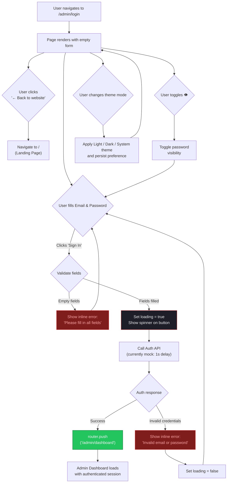
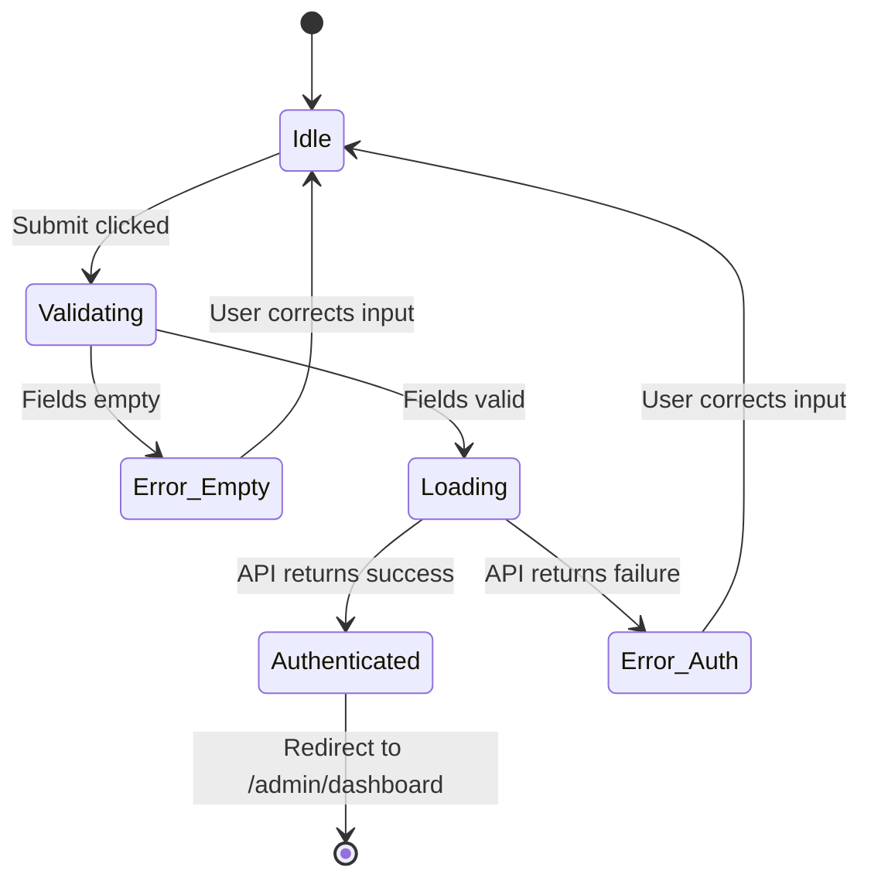

# Implementation Plan: Admin Login Page (`/admin/login`)

## 1. Overview

The Admin Login page is the authentication gateway for all Kireiku staff members. It features a centered glassmorphism login card on top of an immersive dark-first background with animated gradient orbs and a subtle grid pattern. The page is fully standalone (no shared admin layout/sidebar) and supports email/password authentication. Upon successful login, the user is redirected to `/admin/dashboard`. Invalid credentials surface an inline error banner.

This page should now support the same theme system as the public landing page: **Light**, **Dark**, and **System**. Even with theme switching enabled, the art direction should remain **dark-first** so the default first impression still feels premium, gaming-oriented, and distinct from a generic SaaS login screen.

The theme switcher is a **secondary utility**, not a primary action. It should stay visible and discoverable, but it must not compete with the login form, title, or primary CTA.

## 2. ASCII Wireframe

```text
+-----------------------------------------------------------------------------+
|                                                            [☀︎  ☾  ◐]       |
|                                                     theme switcher pill     |
|                        (ambient gradient orb)                               |
|                              ○                                              |
|                         ╱ blur 120px ╲                                      |
|                                                                             |
|                         +-----------------------+                           |
|                         |                       |                           |
|                         |       [K] Logo        |                           |
|                         |      Staff Login      |                           |
|                         |   Restricted area     |                           |
|                         |   for Kireiku staff   |                           |
|                         |                       |                           |
|                         | ╔═══════════════════╗ |                           |
|                         | ║  glass-strong card ║ |                          |
|                         | ║                     ║ |                          |
|                         | ║  Email              ║ |                          |
|                         | ║  ┌─────────────────┐║ |                          |
|                         | ║  │ your@email.com  │║ |                          |
|                         | ║  └─────────────────┘║ |                          |
|                         | ║                     ║ |                          |
|                         | ║  Password           ║ |                          |
|                         | ║  ┌──────────────┬──┐║ |                          |
|                         | ║  │ •••••••••    │👁│║ |                          |
|                         | ║  └──────────────┴──┘║ |                          |
|                         | ║                     ║ |                          |
|                         | ║  ┌─────────────────┐║ |                          |
|                         | ║  │ ⚠ Error message │║ |   (conditional)         |
|                         | ║  └─────────────────┘║ |                          |
|                         | ║                     ║ |                          |
|                         | ║  ╔═════════════════╗║ |                          |
|                         | ║  ║   SIGN IN  →    ║║ |                          |
|                         | ║  ╚═════════════════╝║ |                          |
|                         | ║                     ║ |                          |
|                         | ╚═══════════════════╝ |                           |
|                         |                       |                           |
|                         |  ← Back to website    |                           |
|                         +-----------------------+                           |
|                                                                             |
|                              ○                                              |
|                        (ambient gradient orb)                               |
|                                                                             |
|    . . . . . . . . . . hero-grid (subtle) . . . . . . . . . .              |
+-----------------------------------------------------------------------------+
```

### Element Details

```text
UTILITY CONTROLS (z-20, fixed top-right)
├── Theme switcher: compact glass pill with 3 states
│   ├── Light (sun icon)
│   ├── Dark (moon icon)
│   └── System (monitor icon)

BACKGROUND LAYER (z-0)
├── hero-grid overlay (opacity 30%, 60px grid)
├── Gradient orb (top-right): 500x500, bg-primary/5, blur 120px
└── Gradient orb (bottom-left): 500x500, bg-chart-5/5, blur 120px

CONTENT (z-10, centered vertically & horizontally)
├── LOGO BLOCK (text-center, mb-8)
│   ├── [K] icon: 40x40, rounded-xl, bg-primary, glow-red
│   ├── "Staff Login" — h1, font-bold, text-2xl
│   └── "Restricted area for Kireiku staff" — text-sm, muted
│
├── LOGIN CARD (glass-strong, rounded-2xl, p-8)
│   ├── Email input: bg-white/5, border admin-border
│   ├── Password input: bg-white/5 + eye toggle button
│   ├── Error banner (conditional): text-destructive, bg-destructive/10
│   └── Submit button: bg-primary, full-width, loading spinner state
│
└── BACK LINK ("← Back to website", links to /)
```

## 2.1 Theme Switcher Placement Recommendation

**Recommended placement:** fixed at the **top-right corner of the viewport**, outside the login card, with safe spacing from the edges. Use roughly `top-4 right-4` on mobile and `top-6 right-6` on desktop.

**Why this placement is best:**

- The login card is the primary task area, so utility controls should stay outside it to preserve focus.
- Top-right placement matches common product patterns for appearance preferences, so it feels discoverable without onboarding.
- It keeps the visual hierarchy clean: brand and form remain centered while theme switching stays available but secondary.
- It avoids clutter near the password field, submit button, and error state, which are more sensitive interaction zones.

**What to avoid:**

- Do not place the theme switcher inside the form card header because it competes with the page title and increases cognitive noise.
- Do not place it beside the submit button or validation area because utility actions should not sit next to high-stakes form actions.
- Do not bury it near the footer or only beside the back link because discoverability drops, especially on large screens.

**Recommended interaction pattern:**

- Use a compact **segmented glass pill** for desktop if space allows.
- On smaller screens, the control can collapse into a single icon button that opens a popover with `Light`, `Dark`, and `System`.
- Persist the selected mode across the landing page and admin area so navigation between `/` and `/admin/login` feels continuous.
- If no preference has been chosen, initialize from `system`, but keep the background art tuned so the page still looks strongest in dark mode.

## 3. User Flow Diagram



## 4. Auth State Machine



## 5. UI/UX Notes for Stitch AI

- Keep the login form visually dominant. The theme switcher should read as a utility, not a second CTA.
- The active theme option needs strong enough feedback to be instantly legible: brighter border, filled state, or higher-contrast icon.
- Light mode should still feel premium. Preserve gradients, glass surfaces, and depth instead of flattening the page into a plain white form.
- Theme switching should not cause major layout shift. The page structure, card size, and content rhythm should remain stable across modes.
- Error messages should stay anchored close to the relevant inputs inside the form card.
- Preserving the email value after a failed login is recommended so the recovery path feels faster.
- The back link should remain secondary and quiet; it should not compete with sign-in or the theme control.
- The subtitle `Restricted area for Kireiku staff` is helpful because it gives context immediately and discourages accidental public-user usage.

## 6. Future Integration Notes

- **Phase 2:** Replace mock `setTimeout` with real Supabase `signInWithPassword()`.
- **Phase 2:** Connect the page to the shared app theme provider and persist `light` / `dark` / `system` preference.
- **Phase 2:** Add "Remember me" checkbox tied to Supabase session persistence.
- **Phase 2:** Add rate limiting feedback (e.g., "Too many attempts, try again in 30s").
- **Phase 2:** Redirect already-authenticated users away from this page via middleware.
