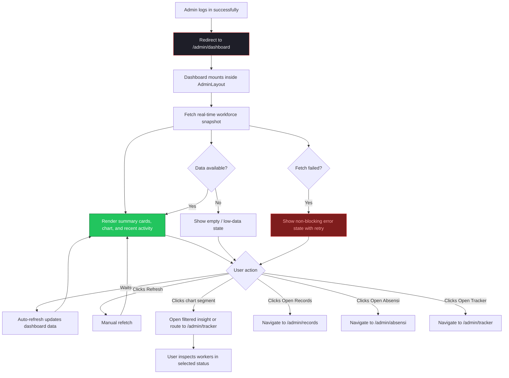
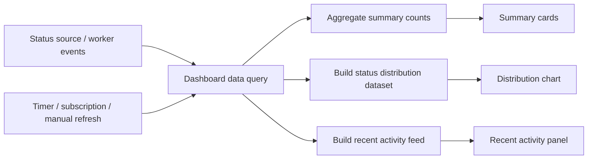

# Implementation Plan: Admin Dashboard (`/admin/dashboard`)

## 1. Overview

The Admin Dashboard is the real-time command center for Kireiku staff management. It is the first secured page users see after login and should answer one question immediately: **"What is happening with the workforce right now?"**

This page lives inside the shared `AdminLayout` and should reuse the existing **Sidebar**, **Admin Header**, and **Live WIB clock** already present in the layout. The dashboard content area should focus on fast scanning, status awareness, and light drill-down behavior rather than deep editing.

The page should prioritize:
- A quick top-level snapshot of current worker status counts.
- A clear visual distribution of workforce states.
- A lightweight live activity feed or alert block for recent changes.
- Fast paths to deeper pages like `/admin/tracker`, `/admin/records`, and `/admin/absensi`.

The dashboard should feel calm, high-signal, and operational. It should not become overcrowded with too many widgets. This page is for monitoring first, analysis second.

## 2. ASCII Wireframe

```text
+--------------------------------------------------------------------------------------------------+
| SIDEBAR (shared)          | HEADER (shared)                                                      |
| [K] Kireiku Admin         | [☰] Kireiku Admin                        WIB 14:32:08      [O]      |
|---------------------------+----------------------------------------------------------------------|
| > Dashboard               |                                                                      |
|   Tracker                 |  DASHBOARD                                                           |
|   Absensi                 |  Real-time status summary and workforce distribution                 |
|   Records                 |                                                                      |
|   Users                   |  [Live now] [Auto-refresh: ON] [Last updated 5s ago] [Refresh]      |
|   Access Manager          |                                                                      |
|   Content                 |  +------------------+ +------------------+ +------------------+      |
|   Profile                 |  | ACTIVE NOW       | | ON BREAK         | | LATE / PENDING   |      |
|                           |  | 48 workers       | | 6 workers        | | 5 workers        |      |
|                           |  | +4 vs 1h ago     | | stable           | | needs attention  |      |
|                           |  +------------------+ +------------------+ +------------------+      |
|                           |                                                                      |
|                           |  +------------------+ +------------------+                           |
|                           |  | OFF / LEAVE      | | TOTAL REGISTERED |                           |
|                           |  | 12 workers       | | 71 workers       |                           |
|                           |  | includes cuti    | | all staff        |                           |
|                           |  +------------------+ +------------------+                           |
|                           |                                                                      |
|                           |  +----------------------------------+  +--------------------------+  |
|                           |  | STATUS DISTRIBUTION              |  | RECENT ACTIVITY          |  |
|                           |  |                                  |  |                          |  |
|                           |  |          ( donut chart )         |  | 14:30  Aulia -> Break   |  |
|                           |  |                                  |  | 14:27  Raka -> On       |  |
|                           |  |  On      48  ███████████         |  | 14:24  Dimas -> Late    |  |
|                           |  |  Break    6  ██                  |  | 14:20  Nia -> Cuti      |  |
|                           |  |  Late     3  █                   |  | 14:18  Sinta -> On      |  |
|                           |  |  Pending  2  █                   |  | 14:12  Arif -> Off      |  |
|                           |  |  Off      8  ██                  |  |                          |  |
|                           |  |  Cuti     3  █                   |  | [View Tracker ->]       |  |
|                           |  +----------------------------------+  +--------------------------+  |
|                           |                                                                      |
|                           |  +----------------------------------------------------------------+  |
|                           |  | TODAY'S SUMMARY                                                 |  |
|                           |  |                                                                |  |
|                           |  | Attendance rate      88%                                        |  |
|                           |  | Avg late minutes     12m                                        |  |
|                           |  | Most common status   On                                         |  |
|                           |  | Flagged workers      4                                          |  |
|                           |  |                                                                |  |
|                           |  | [Open Records] [Open Absensi] [Open Tracker]                   |  |
|                           |  +----------------------------------------------------------------+  |
|                           |                                                                      |
+--------------------------------------------------------------------------------------------------+
```

### Layout Notes

```text
SHARED LAYOUT
├── AdminSidebar (desktop) / MobileNav (mobile)
├── AdminHeader
│   ├── Menu toggle
│   ├── Brand label
│   ├── Live WIB clock
│   └── Avatar dropdown
│
PAGE CONTENT
├── Page heading block
│   ├── "Dashboard"
│   └── supporting description
│
├── Control row
│   ├── Live status badge
│   ├── Auto-refresh status
│   ├── Last updated timestamp
│   └── Manual refresh button
│
├── Summary cards grid
│   ├── Active now
│   ├── On break
│   ├── Late / Pending
│   ├── Off / Leave
│   └── Total registered
│
├── Analytics row
│   ├── Status distribution chart
│   └── Recent activity panel
│
└── Daily summary / quick actions
    ├── Attendance rate
    ├── Avg late minutes
    ├── Flagged workers
    └── Shortcut buttons to deeper admin pages
```

## 3. User Flow Diagram



## 4. Real-Time Data Flow



## 5. UI/UX Notes for Stitch AI

- Keep the page focused on **current operational awareness**. Avoid turning the dashboard into a report page.
- The first screen should answer status questions in under 5 seconds of scanning.
- Summary cards should use clear semantic emphasis:
  - healthy states feel stable and readable
  - risky states like `Late`, `Pending`, or unusual spikes should stand out more
- Do not duplicate the large live clock inside the dashboard body because the shared admin header already provides WIB time.
- The chart should not be decorative only. Each segment should feel useful and ideally support drill-down behavior.
- Recent activity should be short and readable. Around 5 to 8 items is enough before linking to the tracker page.
- Use quick actions sparingly. A few high-value shortcuts are helpful; too many turn the dashboard into a menu.
- On mobile, stack sections vertically in this order:
  1. Heading
  2. Control row
  3. Summary cards
  4. Distribution chart
  5. Recent activity
  6. Daily summary
- If real-time data is delayed, show `Last updated` clearly so users trust what they are seeing.
- If there are no critical issues, the page should still feel informative rather than empty. A calm “all normal” state is valuable.

## 6. Future Integration Notes

- **Phase 2:** Replace mock dashboard data with real Supabase queries or live subscriptions.
- **Phase 2:** Connect summary counts to worker statuses from the tracker system.
- **Phase 2:** Add chart drill-down interactions that route to filtered tracker views.
- **Phase 2:** Add loading skeletons for cards, chart, and activity feed.
- **Phase 2:** Add role-aware visibility if some dashboard blocks should only be visible to certain access tiers.
