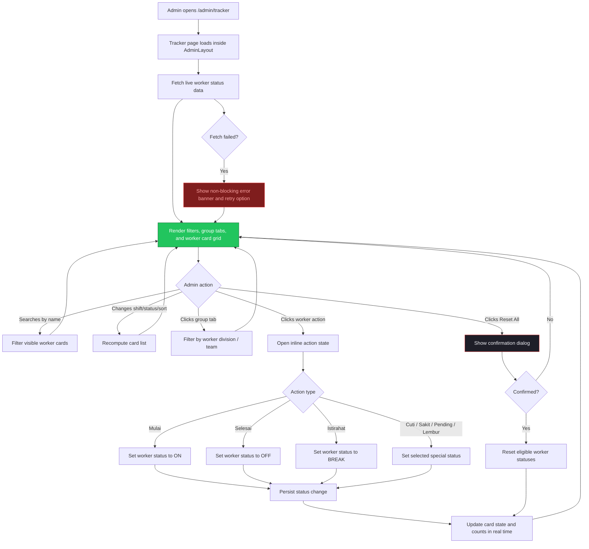
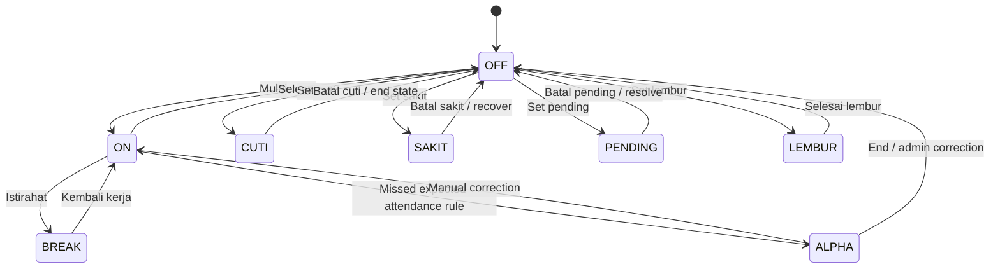

# Implementation Plan: Admin Tracker (`/admin/tracker`)

## 1. Overview

The Admin Tracker page is the operational core of the Kireiku admin panel. This is where staff monitor every worker in real time, review current status at a glance, and perform fast status changes such as starting work, ending a shift, taking a break, marking leave, or setting pending conditions.

This page lives inside the shared `AdminLayout` and should feel denser and more tactical than the dashboard. The primary goal is **speed of scanning and speed of action**. Every important worker state should be visible without opening a detail page.

The page should be designed around four principles:

- **High scanability**: admins must be able to identify risky or abnormal statuses immediately.
- **Fast filtering**: search, shift filters, status filters, and group tabs should reduce visual noise quickly.
- **Safe actions**: status-changing actions should feel fast but still avoid accidental clicks.
- **Live confidence**: the interface should clearly communicate that the data is current, refreshing, and operational.

The attached reference image is a strong direction for the layout: a dense dark command-center interface with a filter toolbar, segmented category tabs, and a responsive grid of worker status cards. That direction should be preserved, while improving clarity where needed.

## 2. ASCII Wireframe

```text
+------------------------------------------------------------------------------------------------------+
| SIDEBAR (shared)          | HEADER (shared)                                                          |
| [K] Kireiku Admin         | [☰] Kireiku Admin                            WIB 18:16:09        [O]      |
|---------------------------+--------------------------------------------------------------------------|
| > Tracker                 |  TRACKER                                                                 |
|   Dashboard               |  Real-time worker tracking grid and status management                    |
|   Absensi                 |                                                                          |
|   Records                 |  [LIVE] [Last sync 3s ago] [Auto-refresh ON]                [Reset All]  |
|   Users                   |                                                                          |
|   Access Manager          |  [ Search name... ] [ All Shift v ] [ All Status v ] [ A-Z v ]          |
|   Content                 |                                                                          |
|   Profile                 |  [All 40|33] [Pro 26|28] [Expert 5|2] [CS 2|1] [Intern 7|2] [...]       |
|                           |                                                                          |
|                           |  +--------------------------+ +--------------------------+               |
|                           |  | AFIF                     | | AGUNG                    |               |
|                           |  | PP-A   06:00-14:00       | | PP-E   22:00-06:00      |               |
|                           |  |                [ALPHA]   | |                   [ON]   |               |
|                           |  | Late 17h 41m | Alpha 2x  | | Late 12h 54m | Cuti 3x  |               |
|                           |  | Cuti 1x                  | |                          |               |
|                           |  |                          | | [ Selesai ] [Istirahat]  |               |
|                           |  | [ Mulai ]                | |                          |               |
|                           |  | [ Cuti ] [ Sakit ]       | +--------------------------+               |
|                           |  | [ Pending ]              |                                                |
|                           |  +--------------------------+ +--------------------------+               |
|                           |  | ALFIN                    | | ALI                      |               |
|                           |  | PP-B   08:00-16:00       | | EP-1   07:00-15:00      |               |
|                           |  |                [SAKIT]   | |              [PENDING]   |               |
|                           |  | Late 1h 24m | Sakit 1d   | | Late 2h 20m | Pending1d |               |
|                           |  | Cuti 2x                  | | Cuti 1x                  |               |
|                           |  | [ Batal Sakit ]          | | [ Batal Pending ]        |               |
|                           |  +--------------------------+ +--------------------------+               |
|                           |                                                                          |
|                           |  +--------------------------+ +--------------------------+               |
|                           |  | AMEL                     | | ANGGA                    |               |
|                           |  | PP-A   06:00-14:00       | | SP   Flexible            |               |
|                           |  |                 [CUTI]   | |                  [OFF]   |               |
|                           |  | Late 3h 24m | Cuti 0x    | | Cuti 5x                  |               |
|                           |  | [ Batal Cuti ]           | | [ Mulai ]                |               |
|                           |  |                          | | [ Cuti ] [ Sakit ]       |               |
|                           |  +--------------------------+ | [ Pending ] [ Lembur ]   |               |
|                           |                               +--------------------------+               |
|                           |                                                                          |
|                           |                               [ Load more / pagination ]                 |
+------------------------------------------------------------------------------------------------------+
```

### Element Details

```text
PAGE HEADER ROW
├── Title: "Tracker"
├── Subtitle: concise operational description
├── Live indicator badge
├── Last sync timestamp
├── Auto-refresh state
└── Reset all statuses button (destructive, guarded)

FILTER TOOLBAR
├── Search by worker name
├── Shift filter
├── Status filter
└── Sort selector

GROUP TABS
├── All
├── Prof. Player
├── Expert Player
├── Customer Service
├── Explorer
├── Security
├── Cleaning
└── Internship

WORKER CARD
├── Worker name
├── Role / shift chip
├── Current status badge
├── Supporting metrics
│   ├── Late duration
│   ├── Alpha count
│   ├── Cuti count
│   ├── Sakit count
│   └── Pending days
├── Primary actions
│   ├── Mulai
│   ├── Selesai
│   └── Istirahat
└── Secondary actions
    ├── Cuti
    ├── Sakit
    ├── Pending
    └── Lembur (optional by role)
```

## 3. User Flow Diagram



## 4. Worker Status Transition Flow



## 5. UI/UX Notes for Stitch AI

- The reference image direction is strong: keep the page visually dense, dark, and command-center-like, but improve spacing discipline so it remains readable during long admin sessions.
- The top toolbar should stay sticky when the grid scrolls. Filters and group tabs are too important to lose on large datasets.
- Status color meaning must stay extremely consistent:
  - `ON` = green
  - `BREAK` = yellow
  - `OFF` = neutral gray
  - `ALPHA` = red
  - `CUTI` = blue
  - `SAKIT` = orange
  - `PENDING` = violet
  - `LEMBUR` = special highlight, but not confused with destructive actions
- Action buttons should be grouped by intent:
  - positive actions like `Mulai` use green emphasis
  - stop/end actions like `Selesai` use red emphasis
  - temporary state actions like `Istirahat` use warning styling
  - secondary administrative states stay quieter
- The worker card should always expose only the actions that make sense for the current status. Avoid showing impossible combinations that create operator confusion.
- `Reset Status` is high risk. It should never be a one-click silent action. Add a confirmation dialog and clearly explain which statuses will be reset.
- Group tabs with counts are very helpful. Keep them horizontally scrollable on smaller screens instead of wrapping into multiple lines.
- Search should debounce slightly so the interface feels smooth without excessive re-rendering.
- Very large grids should support either pagination or incremental loading. Rendering every card at once may make the page heavy and harder to control.
- Consider a subtle pulse or small sync indicator for recently updated cards so admins notice live changes without the whole layout feeling noisy.
- If a worker card contains many historical counters, visually separate **current status** from **historical discipline metrics**. They are both useful, but they should not compete for attention.
- Add a compact empty state message such as `No workers match the current filters` when search/filter combinations return zero cards.
- On mobile, do not try to preserve the exact desktop density. Collapse to a single-column card stack with filters inside a sheet or compact control bar.

## 6. Future Integration Notes

- **Phase 2:** Replace placeholder data with real worker presence and status records from Supabase.
- **Phase 2:** Connect actions to audited status-change mutations so every manual update is traceable.
- **Phase 2:** Add optimistic UI for fast feedback, with rollback if the mutation fails.
- **Phase 2:** Add role-based restrictions so only authorized tiers can trigger bulk resets or certain special statuses.
- **Phase 2:** Add per-worker detail drawer for deeper context without leaving the tracker page.
- **Phase 2:** Support real-time subscriptions so card statuses and counters update live across multiple admins.
